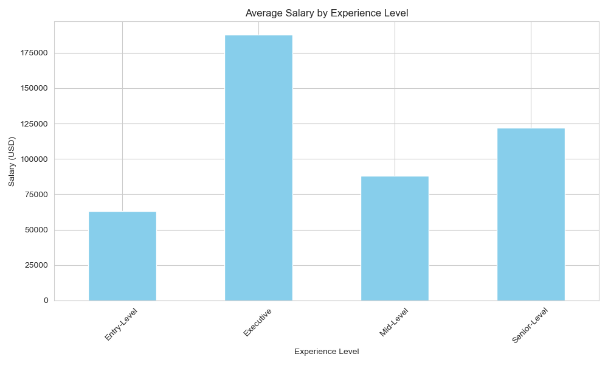
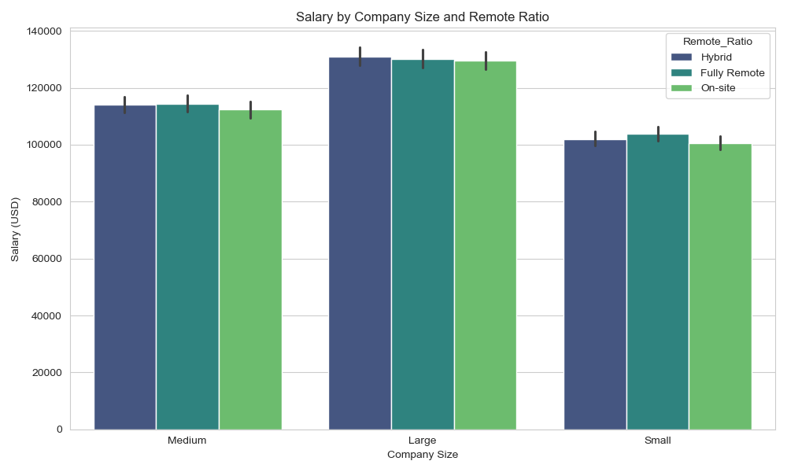
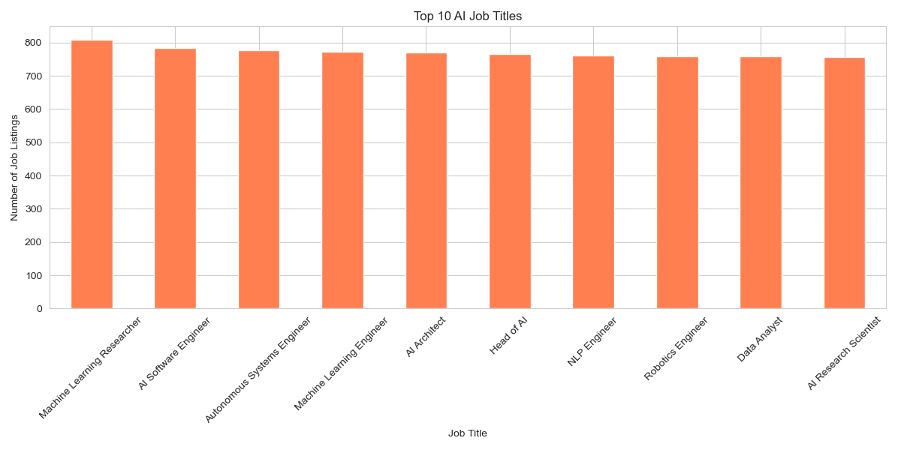
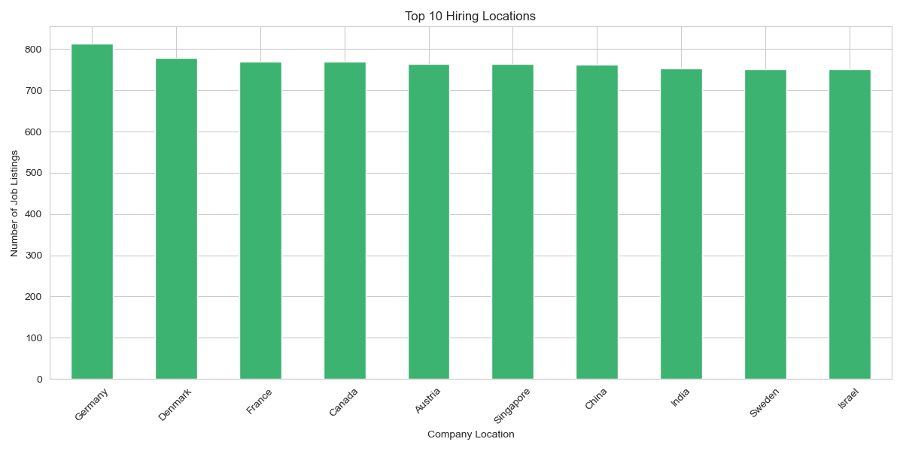
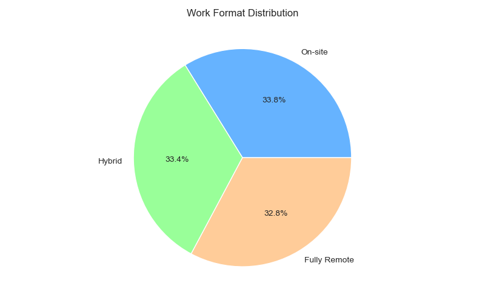
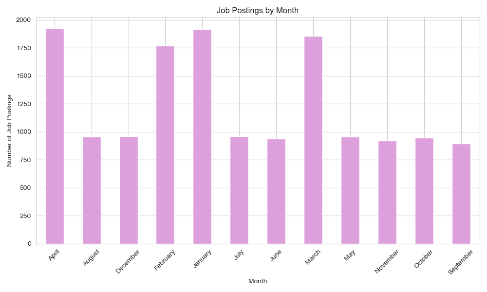
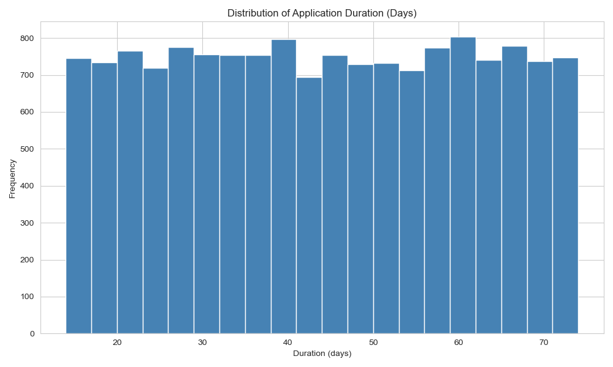

# AI Job Market Analysis (2025)

**Author**: Niranjan  
**Date**: 04 June 2025

---

## Project Overview

This project provides a detailed analysis of the global AI job market in 2025. The focus is on understanding compensation trends, in-demand skills, work formats (remote vs. onsite), hiring locations, and application behavior. The insights aim to guide:

- Organizational hiring and compensation strategies  
- Career planning for AI professionals  
- Policy decisions around AI workforce development  

**Deliverables:**  
- Python notebook: `AI_CareerScope.ipynb`  
- Executive presentation: `AI Career Scope Documentation.pdf`

---

## Data Summary

The dataset consists of over 15,000 AI job listings from diverse industries and regions. Key fields include:

- `Job_Title`: Role designation  
- `Salary_USD`: Annual standardized salary  
- `Experience_Level`: Entry to executive level  
- `Required_Skills`: Skills listed in job postings  
- `Employment_Type`: Full-time, contract, freelance, etc.  
- `Company_Size`: Small, medium, large  
- `Company_Location`: Job location city or region  
- `Remote_Ratio`: Onsite, hybrid, fully remote  
- `Education_Required`: Minimum education qualifications  
- `Posting_Month`: Month job was posted  
- `Application_Duration`: Days the job posting remained open  

---

## Executive Summary

### Key Insights

- Remote roles offer approximately 20% higher salaries than onsite roles  
- FinTech, Healthcare, and Technology sectors dominate in salary and job volume  
- Top hiring locations include San Francisco, Bangalore, London, and Berlin  
- Highly valued skills: Machine Learning, Python, NLP, Deep Learning, Cloud Computing  
- Entry-level roles face higher automation risk (based on external research)  
- Most job postings appear between March and July, with average application windows of 14 to 25 days  

---

## Detailed Insights

### 1. Talent and Salary Optimization

- Salaries increase with experience level, education, and remote work flexibility  
- Small and medium companies offer competitive salaries, especially for remote roles  
- FinTech and Healthcare sectors provide the highest compensation

### 2. Roles and Skills in Demand

- Most frequent job titles: AI Engineer, Data Scientist, ML Researcher  
- Key skills correlating with higher pay include Machine Learning, Python, NLP, Deep Learning, Cloud  
- Advanced skills combined with seniority result in significant salary jumps

### 3. Geographic and Work Format Trends

- Medium-sized tech companies have higher prevalence of remote jobs  
- Onsite roles remain common in government and education sectors  
- Increasing adoption of hybrid and flexible work arrangements globally  

### 4. Hiring Timelines and Application Behavior

- Peak job posting months are March through July  
- Typical application windows range between 14 and 25 days  
- High-paying roles often have shorter application periods, indicating hiring urgency  

---

## Assumptions and Notes

- Entries missing salary data (~5%) were excluded  
- Skill and salary insights are derived from clean and complete listings  
- Automation risk assessment is based on external predictive models and not included in this dataset  
- Remote work status standardized manually for consistency  

---

## Contact

For inquiries or collaboration:  

**Email**: [niranjan991100@gmail.com](mailto:niranjan991100@gmail.com)  
**LinkedIn**: [linkedin.com/in/niranjan-k-a83517229](https://www.linkedin.com/in/niranjan-k-a83517229/)

---

*This analysis demonstrates the use of data analytics to uncover trends shaping the global AI job market in 2025. Feel free to explore the code and reach out for discussion.*
